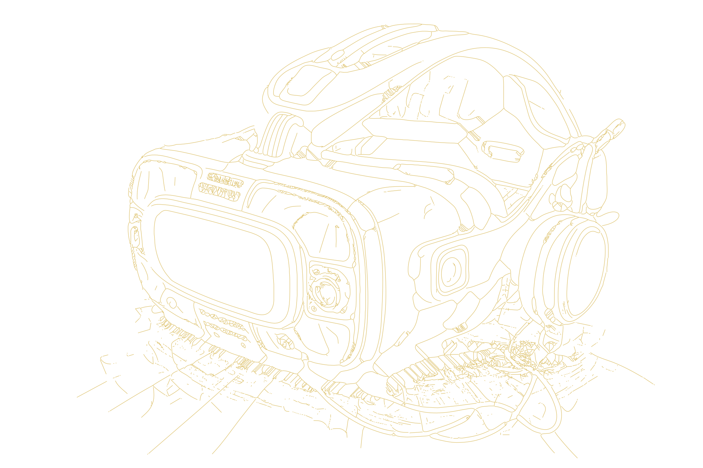

# VR/AR

I'm an experienced virtual and augmented reality rep, ambassador for the Association of Virtual Reality, and have presented at industry conferences such as CzechVRFest, DevConf or LinuxDays.

<!-- <- TODO: Create propper /projects page -->
